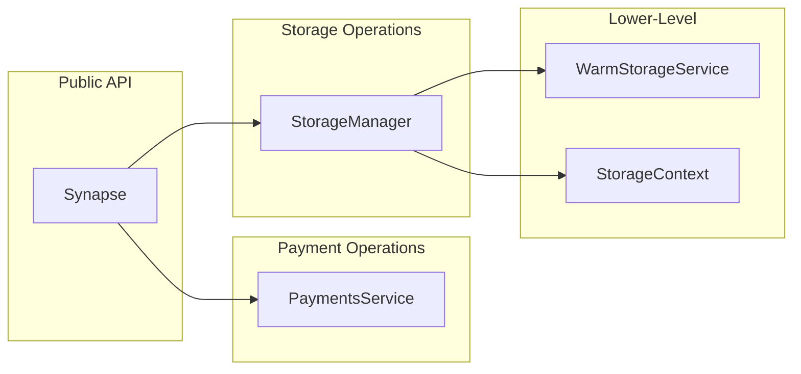

## What is Synapse SDK?

**Synapse SDK** is a TypeScript SDK for interacting with the Filecoin Onchain Cloud - a smart-contract based marketplace for storage and other services in the Filecoin ecosystem. It provides a high-level API for interacting with the system. Additionally, it offers a low-level API for direct interaction with the underlying smart contracts and storage providers.

The SDK integrates with four key components of the Filecoin Onchain Cloud:

- **PDPVerifier**: Proof verification contract powered by [PDP](/core-concepts/pdp-overview/)
- **Filecoin Pay**: Payment layer contract powered by [Filecoin Pay](/core-concepts/filecoin-pay-overview/)
- **Filecoin Warm Storage Service**: Business logic contract powered by [WarmStorage](/core-concepts/fwss-overview/)
- **Service Providers**: Actors that safeguard data stored in the Filecoin Onchain Cloud, powered by the [Curio Storage software](https://github.com/filecoin-project/curio)

:::tip[New to Synapse SDK?]
**Start building in 5 minutes!** Follow the [**Getting Started Guide →**](/getting-started/) to install the SDK, configure your environment, and upload your first file to Filecoin Onchain Cloud.
:::

:::tip[Other Languages?]
Looking for Python or Go? Check out [Community Projects](/resources/community-projects/) for community-maintained SDKs.
:::

## Core Modules

- **`Synapse`**: Is the main entry point with high-level API
- **`PaymentsService`**: Manages deposits, approvals, and payment rails
- **`StorageManager`**, **`StorageContext`**: Storage operation modules
- **`WarmStorageService`**: Storage coordination and pricing module

## Payment Operations

Fund your account and manage payments for Filecoin storage services.

### PaymentsService

The PaymentsService provides direct access to the Filecoin Pay contract, enabling you to:

- Manage token deposits and withdrawals
- Approve operators for automated payments
- Query and settle payment rails
- Monitor account health and balance

[View Payment Operations Guide →](/developer-guides/payments/payment-operations/) - _Learn the basics in less than 10 minutes_

[View Rails & Settlement Guide →](/developer-guides/payments/rails-settlement/) - _Learn the advanced payment concepts_

**API Reference**: [PaymentsService API Reference](/reference/filoz/synapse-sdk/payments/classes/paymentsservice/)

## Storage Operations

Store data on Filecoin Onchain Cloud. The SDK provides storage with multi-copy durability by default. Synapse SDK offers two ways to work with storage operations:

- **Auto-Managed**: The main entry point for storage operations through the `StorageManager` class (`synapse.storage`).
- **Explicit Control**: Use `StorageContext` class for explicit control.

### StorageManager

High-level storage operations with multi-copy durability. Stores data on multiple providers automatically, handling provider selection, SP-to-SP replication, and on-chain commit.

[View Storage Operations Guide →](/developer-guides/storage/storage-operations/) - _Multi-copy uploads in less than 10 minutes_

**API Reference**: [StorageManager API Reference](/reference/filoz/synapse-sdk/storage/classes/storagemanager/)

### StorageContext

Provider-specific split operations (`store` → `pull` → `commit`). Used for batch uploads, custom error handling, and manual orchestration of multi-copy flows.

[View Split Operations Guide →](/developer-guides/storage/storage-context/) - _Manual control over store, pull, and commit_

**API Reference**: [StorageContext API Reference](/reference/filoz/synapse-sdk/storage/classes/storagecontext/)

## WarmStorageService

Low-level module for storage coordination and pricing:

- Storage pricing and cost calculations
- Data set management and queries
- Metadata operations (data sets and pieces)
- Get information about storage providers

[View Storage Costs Guide →](/developer-guides/storage/storage-costs/) - _Learn how to calculate your storage costs_

**API Reference**: [WarmStorageService API Reference](/reference/filoz/synapse-sdk/warmstorage/classes/warmstorageservice/)

## Technical Constraints

### Metadata Limits

Metadata is subject to the following contract-enforced limits:

#### Data Set Metadata

- Maximum of 10 key-value pairs per data set
- Keys: Maximum 32 characters
- Values: Maximum 128 characters

#### Piece Metadata

- Maximum of 5 key-value pairs per piece
- Keys: Maximum 32 characters
- Values: Maximum 128 characters

These limits are enforced by the blockchain contracts. The SDK will validate metadata before submission and throw descriptive errors if limits are exceeded.

### Size Constraints

Upload size limits:

- **Minimum**: 127 bytes (required for PieceCID calculation)
- **Maximum**: ~1 GiB (1,065,353,216 bytes)

:::note
These limits are defined in the SDK constants (`SIZE_CONSTANTS.MIN_UPLOAD_SIZE` and `SIZE_CONSTANTS.MAX_UPLOAD_SIZE`). Future versions will support larger files through chunking and aggregate PieceCIDs.

See [this issue](https://github.com/FilOzone/synapse-sdk/issues/110) for details.
:::

### PieceCID

Understanding PieceCID is essential for working with Filecoin storage, as it serves as the unique identifier for your uploaded data.

PieceCID is Filecoin's native content address identifier, a variant of [CID](https://docs.ipfs.tech/concepts/content-addressing/). When you upload data, the SDK calculates a PieceCID—an identifier that:

- Uniquely identifies your bytes, regardless of size, in a short string form
- Enables retrieval from any provider storing those bytes
- Contains embedded size information

**Format Recognition:**

- **PieceCID**: Starts with `bafkzcib`, 64-65 characters - this is what Synapse SDK uses
- **LegacyPieceCID**: Starts with `baga6ea4seaq`, 64 characters - for compatibility with other Filecoin services

PieceCID is also known as "CommP" or "Piece Commitment" in Filecoin documentation. The SDK exclusively uses PieceCID (v2 format) for all operations—you receive a PieceCID when uploading and use it for downloads.

LegacyPieceCID (v1 format) conversion utilities are provided for interoperability with other Filecoin services that may still use the older format.

**Technical Reference:** See [FRC-0069](https://github.com/filecoin-project/FIPs/blob/master/FRCs/frc-0069.md) for the complete specification of PieceCID ("v2 Piece CID") and its relationship to LegacyPieceCID ("v1 Piece CID"). Most Filecoin tooling currently uses v1, but the ecosystem is transitioning to v2.

## Additional Resources

- [Getting Started](/getting-started/) - Installation and setup guide
- [Payment Operations Guide](/developer-guides/payments/payment-operations/) - Complete payment operations reference
- [Storage Operations Guide](/developer-guides/storage/storage-operations/) - Complete storage operations reference
- [API Reference](/reference/filoz/synapse-sdk/toc/) - Full API documentation
- [GitHub Repository](https://github.com/FilOzone/synapse-sdk) - Source code and examples
