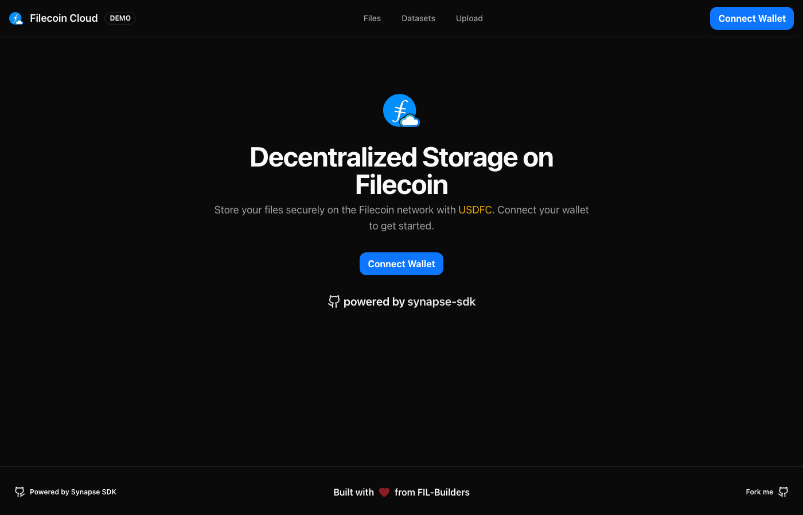

This page highlights real projects that show Synapse and Filecoin Onchain Cloud (FOC) in action. Start with the FOC WG spotlight projects, then explore additional community-built SDKs and tooling.

:::note[How to Use This Page]
Use these repositories as reference implementations when planning your own FOC integration, especially for storage UX, wallet flows, and on-chain indexing.
:::

:::caution[Ownership and Support]
Projects in **FOC WG Spotlight** are maintained by the FOC Working Group. Projects in **Additional Community Projects** are maintained by external contributors. For support and compatibility questions, refer to each project's repository.
:::

## FOC WG Spotlight

| Project | Demo | Source |
| --- | --- | --- |
| Filecoin Pin | [Open Demo](https://pin.filecoin.cloud/) | [GitHub](https://github.com/filecoin-project/filecoin-pin) |
| FOC Upload dApp | [Open Demo](https://foc-demo.filbuilders.eth.limo/) | [GitHub](https://github.com/FIL-Builders/foc-upload-dapp) |

### Filecoin Pin

`Filecoin Pin` is a reference pinning app built on FOC primitives. It is a good starting point for understanding production-style upload, IPFS pin management, and retrieval flows.

### FOC Upload dApp

`FOC Upload dApp` demonstrates an upload-first flow with wallet-connected interactions. Use it as a baseline for quickly integrating Synapse/FOC upload workflows in your own dApp.

- Best for: rapid upload dApp prototyping
- Integration focus: minimal end-to-end storage flow with wallet UX

## Additional Community Projects

### SDKs

#### Python

**[pynapse](https://github.com/anjor/pynapse)** — A Python SDK for interacting with Filecoin Onchain Cloud services.

- Upload and download data
- Payment and allowance management
- Provider discovery

#### Go

**[go-synapse](https://github.com/data-preservation-programs/go-synapse)** — A Go SDK for Filecoin Onchain Cloud.

- Native Go implementation
- Suitable for backend services and CLI tools

### Tools

#### FWSS Subgraph

**[fwss-subgraph](https://github.com/FIL-Builders/fwss-subgraph)** — Indexes on-chain data from the Filecoin Warm Storage Service contracts, making it easy to query data sets, pieces, payment rails, and provider activity using GraphQL.

## Contributing

Have a project you'd like to add? Open a pull request to this page with your project details.
