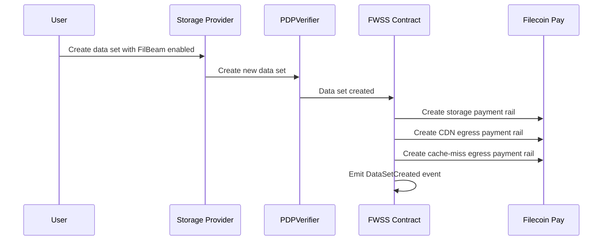
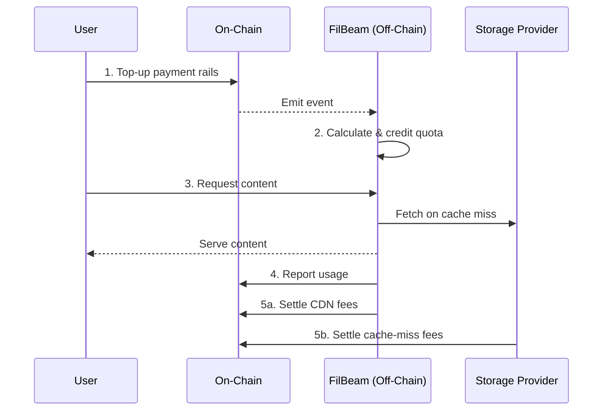
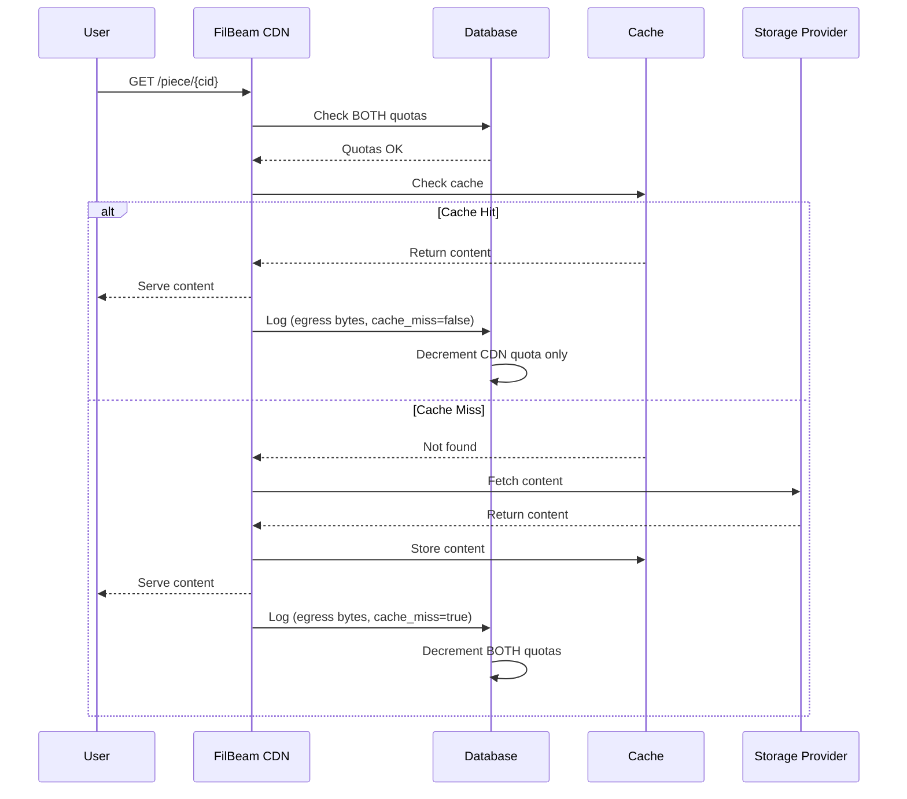
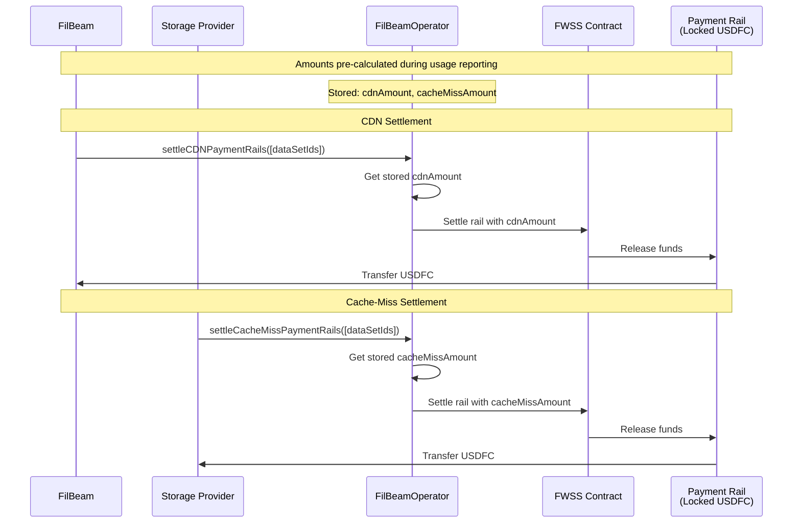
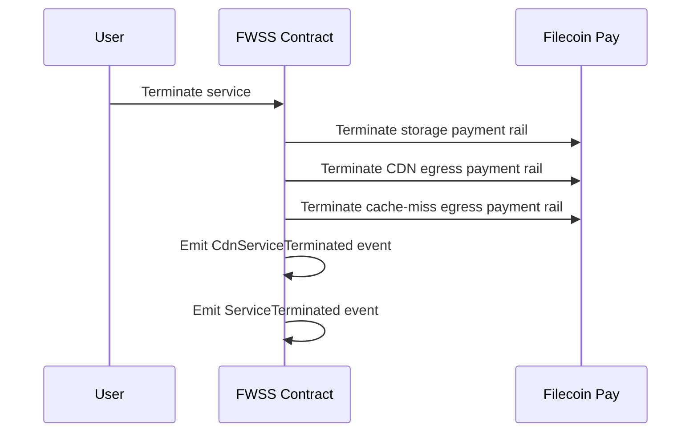

This document explains how FilBeam's pay-per-byte payment model works, including the complete flow from on-chain top-up to settlement.

## Overview

FilBeam uses a **hybrid on-chain/off-chain model**:

- **On-chain**: Top-ups, usage reporting, and settlement
- **Off-chain**: Quota calculation, caching, request serving, and usage tracking

This design provides usage and payment transparency while maintaining high performance for content delivery.

## Payment Rails Setup

When a data set is created with FilBeam enabled, the FWSS contract creates three payment rails:



| Payment Rail | Payer | Payee | Purpose |
|--------------|-------|-------|---------|
| Storage | User | Storage Provider | Ongoing storage costs |
| CDN Egress | User | FilBeam | CDN delivery fees |
| Cache-Miss Egress | User | Storage Provider | Retrieval from origin |

Unlike the storage payment rails, CDN and cache-miss rails do not have a set payment rate. Rather, these rails use fixed lockup and are settled via one-time payments. 

See [Payment Rails](../reference/payment-rails) to learn how do payment rails work in Filecoin Pay.

## Complete Payment Flow



## Phase 1: Top-Up (On-Chain)

The user tops up their FilBeam payment rails by calling the FWSS contract's `topUpCDNPaymentRails` method with the desired USDFC amounts for CDN and cache-miss rails.

**What happens on-chain:**
1. USDFC is locked in payment rails (CDN rail + cache-miss rail)
2. Contract emits `CDNPaymentRailsToppedUp` event with amounts
3. Funds are reserved but not yet transferred to anyone

See [Top Up CDN Quota](../how-to/top-up-cdn-quota) for step-by-step instructions.

## Phase 2: Quota Calculation (Off-Chain)

The FilBeam Indexer receives the blockchain event and calculates quotas:

```
CDN Quota (bytes) = (USDFC amount × BYTES_PER_TIB) / CDN_RATE
Cache Miss Quota (bytes) = (USDFC amount × BYTES_PER_TIB) / CACHE_MISS_RATE
```

The updated quota is stored in FilBeam's database.

To learn about the effective rates used, see [Pricing](pricing).

## Phase 3: Content Delivery (Off-Chain)

When users request content, FilBeam serves it and tracks usage:



:::note
**Note:** Both quotas are checked before the cache lookup. This means requests require both CDN and cache-miss quota to be available, even if the content is cached. We plan to optimize this in a future release — track progress in [filbeam/worker#398](https://github.com/filbeam/worker/issues/398).
:::

**Quota deduction rules:**

| Request Type | CDN Quota | Cache Miss Quota |
|--------------|-----------|------------------|
| Cache Hit | -N bytes | unchanged |
| Cache Miss | -N bytes | -N bytes |

Each request is logged to the database for future processing.

## Phase 4: Usage Reporting (On-Chain)

Periodically, the Usage Reporter aggregates logs and reports usage to the blockchain via `FilBeamOperator.recordUsageRollups`. This records both CDN bytes (total egress) and cache-miss bytes (storage provider compensation) for each data set.

**Reporting schedule:**
- Calibration testnet: Every 30 minutes
- Mainnet: Every 4 hours

See [Usage Reporting](usage-reporting) for details on what gets reported and why.

## Phase 5: Settlement (On-Chain)

Settlement transfers funds from payment rails to **recipient's Filecoin Pay account**. Both FilBeam and storage providers call the **FilBeamOperator** contract to settle their respective rails.

### How Settlement Amounts Are Calculated

Settlement amounts are **pre-calculated during usage reporting** (Phase 4), not during settlement:

```
CDN Amount = reportedCdnBytes × cdnRatePerByte
Cache-Miss Amount = reportedCacheMissBytes × cacheMissRatePerByte
```

These amounts are stored in the contract and accumulate with each usage report. Settlement simply transfers the accumulated amounts.

### CDN Settlement (FilBeam)

FilBeam calls `FilBeamOperator.settleCDNPaymentRails` to claim accumulated CDN fees. The pre-calculated amount is transferred from the payment rail to FilBeam's Filecoin Pay account.

### Cache-Miss Settlement (Storage Providers)

Storage providers call `FilBeamOperator.settleCacheMissPaymentRails` to claim their compensation for serving cache misses. The pre-calculated amount is transferred from the payment rail to the provider's Filecoin Pay account.

### Settlement Flow



### Settlement Details

- **Anyone can call** the settlement methods, but funds go to the designated payee's Filecoin Pay accountked funds are insufficien
- **Partial settlements** are supported if loct
- **Amounts accumulate** between settlements - no need to settle after every usage report

## Cost Breakdown

Both payment rails charge **$7/TiB**. The effective cost depends on the request type:

| Request Type | CDN Rail | Cache-Miss Rail | Total Cost |
|--------------|----------|-----------------|------------|
| **Cache Hit** | $7/TiB | — | **$7/TiB** |
| **Cache Miss** | $7/TiB | $7/TiB | **$14/TiB** |

The $14/TiB cache-miss cost comes from being charged on BOTH rails.

## Service Termination

FilBeam service can be terminated in two ways:

Full termination — Deletes the data set. Available to users.
FilBeam-only termination — Retains the data set. Reserved for FilBeam controller to enforce sanctions compliance when a user's wallet is flagged.

Users who wish to stop using FilBeam must perform a full termination, which includes deleting the data set:



## See Also

**Explanations:**
- [Quota System](quota-system) - Understanding the dual quota design
- [Usage Reporting](usage-reporting) - Why usage is reported on-chain

**How-To Guides:**
- [Top Up CDN Quota](../how-to/top-up-cdn-quota) - Step-by-step instructions
- [Monitor Usage](../how-to/monitor-usage) - Check your quotas and usage

**Reference:**
- [Pricing](pricing) - Detailed pricing information
